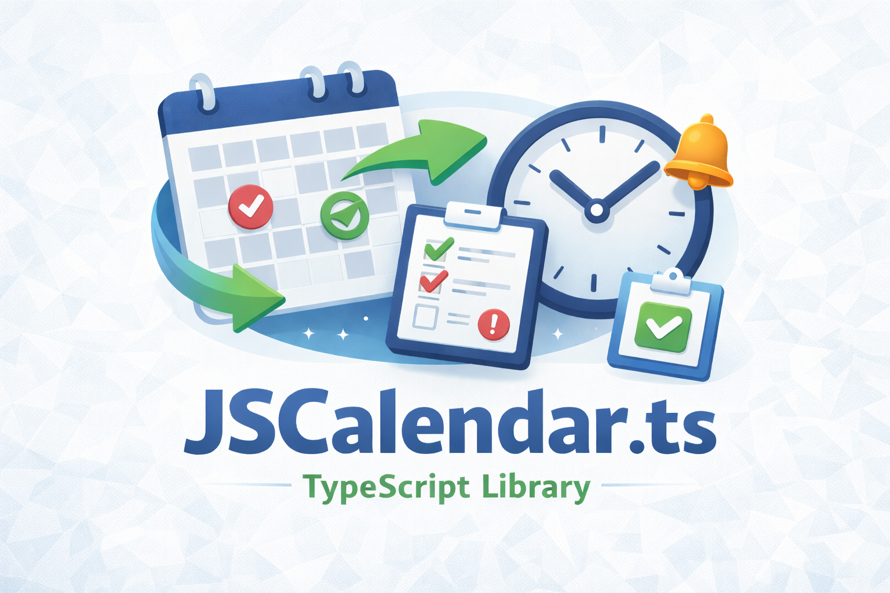

<p align="center">
  
</p>

# RFC 8984 (JSCalendar) TypeScript Library

This library provides a thin, practical TypeScript API for working with
RFC 8984 (JSCalendar) objects while staying close to the spec. It focuses
on creation, patching, recurrence expansion, search, and iCalendar export.
It does **not** implement a calendar application or server; it is a data
model toolkit you can use in web apps, CLIs, or services.

Primary object types are **Event**, **Task**, and **Group**. A **Group**
acts as a container when you want to bundle multiple objects. The API is
intentionally small but opinionated: constructors normalize required
fields, validation is strict by default, and `patch` applies RFC 8984
PatchObject semantics.

For developer experience, the library offers builder helpers that fill
`@type` fields and validate nested structures (participants, locations,
alerts, recurrence rules, and more). You can still pass raw, typed
JSCalendar objects directly when your data already matches the spec.

## Installation

```bash
pnpm add @craftguild/jscalendar
```

## Quick Start

```ts
import { JsCal } from "@craftguild/jscalendar";

// Create a recurring event and a simple task, then expand occurrences.
const event = new JsCal.Event({
    title: "Weekly Sync",
    start: new Date(2026, 0, 1, 0, 0, 0, 0),
    recurrenceRules: [
        JsCal.RecurrenceRule({
            frequency: "weekly",
            byDay: [JsCal.ByDay({ day: "th" })],
        }),
    ],
});

const task = new JsCal.Task({
    title: "Prepare Notes",
    start: new Date(2026, 0, 1, 0, 0, 0, 0),
});

const from = new Date(2026, 0, 1, 0, 0, 0, 0);
const to = new Date(2026, 0, 31, 0, 0, 0, 0);
const generator = JsCal.expandRecurrence([event, task], { from, to });

for (const item of generator) {
    // Expanded JSCalendar objects for events and tasks in the range.
    console.log(JSON.stringify(item));
}
```

Sample output (truncated):

```txt
{"title":"Weekly Sync","@type":"Event","start":"2026-01-01T00:00:00",...}
{"title":"Prepare Notes","@type":"Task","start":"2026-01-01T00:00:00",...}
{"title":"Weekly Sync","@type":"Event","start":"2026-01-08T00:00:00",...}
```

## Object Creation

Objects are created with `new JsCal.Event`, `new JsCal.Task`, and
`new JsCal.Group`. Each constructor accepts a plain JSCalendar-like
object and normalizes required fields (e.g., `uid`, `updated`).

### Event

```ts
const event = new JsCal.Event({
    title: "Team Sync",
    start: "2026-02-10T10:00:00",
    timeZone: "America/New_York",
    duration: "PT30M",
});
```

### Task

```ts
const task = new JsCal.Task({
    title: "Write report",
    start: "2026-02-11T09:00:00",
    due: "2026-02-11T17:00:00",
    percentComplete: 10,
});
```

### Group

`entries` accepts either plain JSCalendar objects (including `eject()` results)
or `JsCal.Event`/`JsCal.Task` instances.

```ts
const group = new JsCal.Group({
    title: "Project A",
    entries: [event, task.eject()],
});
```

## Builder Helpers (Strict, Validated Inputs)

JSCalendar objects require `@type` fields for nested objects like
participants, locations, alerts, and recurrence rules. Requiring every
caller to manually specify `@type` is noisy and error-prone. To avoid
leaking RFC-specific details into app code, this library provides
**builder helpers** that:

- Fill in the correct `@type`
- Validate the result against RFC 8984 immediately

You can still pass strict plain JSCalendar objects directly (e.g., from
your database), but builders offer a safer, clearer option for app code.

### Using builders (recommended for app code)

```ts
const task = new JsCal.Task({
    title: "Write report",
    start: "2026-02-11T09:00:00",
    participants: JsCal.participants([
        {
            value: JsCal.Participant({
                name: "Alice",
                email: "a@example.com",
                roles: { attendee: true },
            }),
        },
        {
            value: JsCal.Participant({
                name: "Bob",
                roles: { attendee: true },
            }),
        },
    ]),
    locations: JsCal.locations([{ value: JsCal.Location({ name: "Room A" }) }]),
    alerts: JsCal.alerts([
        {
            value: JsCal.Alert({
                trigger: JsCal.OffsetTrigger({
                    offset: JsCal.duration.minutes(-15),
                }),
            }),
        },
    ]),
});
```

### Using strict plain objects (for DB/imported data)

```ts
const task = new JsCal.Task({
    title: "Imported task",
    start: "2026-02-11T09:00:00",
    participants: {
        p1: {
            "@type": "Participant",
            name: "Alice",
            email: "a@example.com",
            roles: { attendee: true },
        },
    },
    locations: {
        l1: { "@type": "Location", name: "Room A" },
    },
    alerts: {
        a1: {
            "@type": "Alert",
            trigger: { "@type": "OffsetTrigger", offset: "-PT15M" },
        },
    },
});
```

### Validation behavior

Builders validate on creation, and constructors validate on object
creation. That means:

- Builder inputs are validated immediately
- `new JsCal.Event/Task/Group(...)` also validates the final object

This double validation is intentional for safety: even if data originates
from an untrusted or inconsistent source, you still get strict RFC 8984
checks at the point of object creation.

## Ejecting to plain objects

`JsCal.Event`/`JsCal.Task` are class instances with helper methods and a
`data` field that stores the RFC 8984 object. `eject()` returns a deep
clone of that underlying JSCalendar object for serialization, storage,
or passing across app boundaries.

Why `eject()` exists:

- Class instances are convenient for building and updating objects with
  helpers like `patch`.
- External APIs, storage layers, and JSON stringify expect plain objects.
- A deep clone makes it safe to hand off data without accidental mutation
  from the original instance (and vice versa).

What changes after `eject()`:

- You lose helper methods; the result is just a plain JSCalendar object.
- Mutating the plain object does not affect the original instance.
- The instance can still be used and updated independently.

```ts
const event = new JsCal.Event({
    title: "Kickoff",
    start: "2026-02-02T10:00:00",
});
const plain = event.eject();

// Plain object is ready for JSON / storage / network.
JSON.stringify(plain);

// Changes do not affect each other.
plain.title = "Exported";
const updated = event.patch({ title: "Live" });
```

## Patch Usage

Patch helpers return new instances and keep metadata such as
`updated` and `sequence` consistent. Use `patch` for RFC 8984 PatchObject
semantics. You can set raw values directly, or use helper methods if you
prefer validated, type-safe inputs.

```ts
const patchedEvent = event.patch({ title: "Updated title" });
const patchedAgain = patchedEvent.patch({ title: "Patched title" });
```

You can also patch nested maps by replacing the full map in one call:

```ts
const withParticipants = event.patch({
    participants: {
        p1: {
            "@type": "Participant",
            roles: { attendee: true },
            email: "a@example.com",
        },
    },
});
```

Two common patterns for nested patches:

1. Set raw values directly

```ts
const withLocations = event.patch({
    locations: {
        l1: { "@type": "Location", name: "Room A" },
    },
});
```

2. Use helpers to build or merge map values

```ts
const withLocations = event.patch({
    locations: JsCal.locations([
        { id: "l1", value: JsCal.Location({ name: "Room A" }) },
        { value: JsCal.Location({ name: "Room B" }) },
    ]),
});
```

To merge into an existing map, pass the current map as the second argument:

```ts
const withLocations = event.patch({
    locations: JsCal.locations(
        [{ value: JsCal.Location({ name: "Room C" }) }],
        event.data.locations,
    ),
});
```

## Date Inputs and Time Zones

Date fields accept either RFC 8984 strings or JavaScript `Date`. When a
`Date` is given, `start`/`due` are converted to LocalDateTime strings and
`updated`/`created` are converted to UTCDateTime (`Z` suffix). If a
`timeZone` is set, it is normalized through the bundled time zone list.

`start`, `due`, `updated`, and `created` accept `string` or `Date`.

```ts
const eventFromDate = new JsCal.Event({
    title: "Kickoff",
    start: new Date(),
});

const eventWithSeconds = new JsCal.Event({
    title: "Kickoff",
    start: new Date(),
    duration: 90 * 60, // seconds
});

const eventWithZone = new JsCal.Event({
    title: "Kickoff",
    start: new Date(),
    timeZone: JsCal.timeZone("asia/tokyo"), // => Asia/Tokyo
});
```

## Utility Methods

All utilities are available on `JsCal`.

The search helpers operate on JSCalendar objects or `JsCal` instances.
They are intended for lightweight filtering and text matching in
application code. For more complex queries, use your datastore’s
query engine or build a custom index.

```ts
const results = JsCal.filterByDateRange(items, {
    start: "2026-02-01T00:00:00Z",
    end: "2026-02-28T23:59:59Z",
});

const found = JsCal.findByUid(items, "uid-123");
const byType = JsCal.filterByType(items, "Event");
const grouped = JsCal.groupByType(items);
const textHits = JsCal.filterByText(items, "meeting");

const uid = JsCal.createUid();
const id = JsCal.createId();

const d1 = JsCal.duration.minutes(90); // PT1H30M
const d2 = JsCal.duration.from({ hours: 1, minutes: 15 }); // PT1H15M

const tz = JsCal.timeZone("asia/tokyo"); // => Asia/Tokyo
const tzList = JsCal.timeZones;
```

## Recurrence Expansion

The recurrence expansion API is a generator.

Expansion follows RFC 8984 semantics for recurrence rules, including
overrides and exclusions. The output instances contain `recurrenceId`
and preserve the base object’s data unless a patch modifies fields.

```ts
for (const occ of JsCal.expandRecurrence([event], {
    from: new Date("2026-02-01"),
    to: new Date("2026-03-01"),
})) {
    console.log(occ);
}
```

### Paged Expansion (for infinite scroll)

`expandRecurrencePaged` wraps the generator and provides a cursor-based
paging interface. This is convenient when rendering a list with virtual
scrolling or an infinite feed.

```ts
const page1 = JsCal.expandRecurrencePaged(
    [event],
    { from: new Date("2026-02-01"), to: new Date("2026-03-01") },
    { limit: 50 },
);

const page2 = JsCal.expandRecurrencePaged(
    [event],
    { from: new Date("2026-02-01"), to: new Date("2026-03-01") },
    { limit: 50, cursor: page1.nextCursor },
);
```

## Time Zone Aware Filtering (Date range)

If `timeZone` is set, `Date` inputs are converted to that time zone
via `date-fns-tz` before comparison.

This ensures that “wall-clock time” comparisons respect the event’s
time zone, including DST transitions, as long as the event defines
`timeZone`. Floating LocalDateTime values without `timeZone` are
compared as simple strings.

```ts
const event = new JsCal.Event({
    start: "2026-02-01T10:00:00",
    timeZone: "Asia/Tokyo",
});

// 2026-02-01T01:00:00Z is 10:00 in Asia/Tokyo
const results = JsCal.filterByDateRange([event], {
    start: new Date("2026-02-01T01:00:00Z"),
    end: new Date("2026-02-01T01:00:00Z"),
});
console.log(results.length); // 1
```

## iCalendar Export

Export uses a minimal mapping from JSCalendar to iCalendar. Any fields
that cannot be represented are preserved in `X-JSCALENDAR` to avoid data
loss. This keeps exports reversible while staying compatible with most
consumers.

```ts
// includeXJSCalendar defaults to true.
const ical = JsCal.toICal([event]);
const icalNoX = JsCal.toICal([event], { includeXJSCalendar: false });
console.log(ical);

const icalMany = JsCal.toICal([event, task], { includeXJSCalendar: true });
console.log(icalMany);
```

## Compliance and Deviations

### RFC 8984 Conformance (Implemented)

These points are implemented directly as specified in RFC 8984 and are
covered by tests.

- Core JSCalendar object model (Event / Task / Group) as TypeScript types.
- Recurrence rules and overrides (RRULE/EXRULE semantics in RFC 8984).
- Default values for fields defined by RFC 8984 (e.g., `sequence`, `priority`, `freeBusyStatus`, etc.).
- LocalDateTime and UTCDateTime handling with explicit types.
- iCalendar export with `X-JSCALENDAR` for data preservation.

### Deviations / Partial Implementations

This library is designed to be practical and lightweight, not a full RFC engine.

The items below are the known deltas between a strict RFC implementation
and this library’s behavior.

- **rscale**: only `gregorian` is supported; any other value throws.
- **Validation**: strict type/format validation is enforced by default (RFC-style date/time and duration rules),
  but can be disabled with `{ validate: false }` in create/update/patch.
- **Time zone and DST**:
    - Range filtering and recurrence comparisons use `date-fns-tz`.
    - Recurrence generation still operates on LocalDateTime arithmetic and does not fully normalize
      DST gaps/overlaps into canonical UTC instants for all cases.
- **iCalendar export**: minimal mapping + `X-JSCALENDAR`; no VTIMEZONE generation.

If you require strict, formal compliance, please treat this as a foundation
and extend the validation/export behavior in your own application.

## Reference Materials

- RFC 8984: JSCalendar specification.
- RFC 7529: Non-Gregorian recurrence rules used by JSCalendar (rscale).
- Time zone identifiers: IANA Time Zone Database (tzdata), using Area/Location IDs
  (e.g., America/New_York, Asia/Tokyo).

## Code of Conduct

See `CODE_OF_CONDUCT.md`.

## Contributing

See `CONTRIBUTING.md`.

## License

See `LICENSE.md`.
